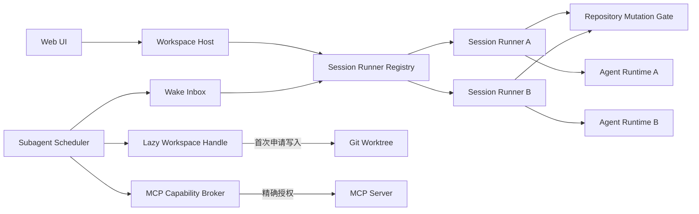

# Coding Agent 调度与子 Agent 能力演进方案

## 1. 目标

本方案汇总以下五项改造，并以最小可落地版本为优先：

1. 主 Agent 运行可取消，运行期间允许切换到其他 session 并发对话。
2. 子 Agent 在完成、阻塞或请求信息/工具时，可以主动唤醒主 Agent；主 Agent 忙时进入队列。
3. 子 Agent 默认不创建 worktree，仅在需要修改文件时按需创建。
4. 主 Agent 可以向子 Agent 分配经过收窄授权的 MCP 工具。
5. 任务契约、结果证据和 provenance 使用结构化数据，修复来源声明混入总结文本的问题。

本阶段不追求多进程、分布式租约或 Host 重启后的自动接管，仍保留单 Host、SQLite 和最多
两个子 Agent 的约束。

## 2. 当前实现与问题

### 2.1 主 Agent 被 workspace 级全局串行化

当前 `CodingAgentHost` 只有：

- 一个 `ThreadPoolExecutor(max_workers=1)`；
- 一个 workspace 级 `_operation_lock`；
- 一个全局 `_future`；
- 一个当前 `session_id`、`coordinator` 和绑定到当前 session 的子 Agent manager。

因此只要一个 turn 已运行：

- 不能创建或选择其他 session；
- 不能提交另一个 session 的 turn；
- UI 也通过全局 `running` 禁止 session 切换；
- 所有 session 实际共享一个“当前运行槽位”。

### 2.2 当前取消不是协作式取消

`cancel_operation()` 调用 `asyncio.Future.cancel()`。线程池任务一旦开始执行，`cancel()` 通常
返回 `False`，所以主 Agent 的模型流、审批等待和 ToolRun 都不会停止。

子 Agent 已有 `threading.Event` 形式的取消令牌，可作为主 Agent 改造的参考，但主 Agent
还需要覆盖：

- LangGraph 模型流；
- 后台 ToolRun；
- MCP 调用；
- Human-in-the-loop 审批等待；
- turn 提交和 workspace snapshot。

### 2.3 子 Agent 只能被轮询，不能主动唤醒

当前主 Agent 只能调用 `wait_agent_tasks` 或 `inspect_agent_task`。子 Agent 事件虽然持久化，
但没有：

- wake inbox；
- session 调度器；
- 每个消费者独立 cursor；
- 子 Agent 暂停并请求主 Agent 的协议；
- 主 Agent 回复后恢复同一 Attempt 的能力。

### 2.4 worktree 在 Attempt 启动时无条件创建

`_run_agent_attempt()` 在模型运行前直接调用 `create_attempt()` 创建 worktree。即使任务只做
分析、检索或调用外部 MCP，也会产生 branch、目录和清理成本。

同时，现有本地工具在 Runtime 构造时捕获固定的 `workspace_root` 和 `repo_root`，不能在
运行中从只读视图切换到新 worktree。

### 2.5 子 Agent 不能获得 MCP 工具

子 Agent 的 `allowed_tools` 只允许 `_CHILD_TOOLS` 中的固定本地工具。虽然每个
`AgentRuntime` 都能创建 `LazyMCPToolProvider`，但允许工具过滤发生在 provider 暴露的
`activate_configured_mcp`、`call_configured_mcp` 两个通用入口上：

- 契约无法表达允许哪个 server、哪个远端工具；
- 一旦开放通用调用入口，子 Agent 理论上可调用该 provider 下的其他工具；
- 授权范围、外部副作用和审计信息不够精确。

### 2.6 provenance 异常文本的实际数据链路

当前结果链路是：

```text
子 Agent 最后一条自由文本回复
  -> AgentRuntime.run_turn() response
  -> result.committed.payload.summary
  -> SubagentCard <p>{summary}</p>
```

前后端没有 `ResultEnvelope` 解析或 provenance 分离。类似：

```text
= · = · = ... P · R · O · V · E · N · A · N · C · E ...
Source: deep_wiki MCP tools ...
```

的内容不是任务契约本身被编码，而是模型或上游工具生成的来源声明混入了自由文本
`summary`，随后被 UI 原样展示。当前 UI 中确实使用 ` · ` 拼接工具名和路径，但
`summary` 本身没有前端字符转换。不能通过全局删除 `·` 或正则删除 `PROVENANCE` 修复，
否则会破坏合法输出。

## 3. 总体设计



核心约束：

- 同一 session 同时只运行一个主 Agent turn，保证同一 LangGraph thread 不并发写 checkpoint。
- 不同 session 可以并行执行模型和只读工具。
- 当前主工作区仍是共享可变资源，所有主 Agent workspace 写入、snapshot、restore 和子结果
  集成必须经过 `RepositoryMutationGate`。
- 最小版本不承诺多个主 Agent session 同时修改同一 workspace。需要写入而租约被占用时，
  operation 进入 `waiting_workspace`，不能继续基于可能变化的文件上下文执行。
- 后续若要求真正并行写入，应将主 Agent session 也迁移到独立 worktree，而不是放宽锁。

## 4. 改造一：主 Agent 可取消和跨 session 并行

### 4.1 运行模型

新增 `SessionRunnerRegistry`，按 `session_id` 保存：

```text
SessionRunner
  session_id
  coordinator
  runtime/thread_id
  operation_queue
  active_operation_id
  cancellation_token
  wake_pending
```

将 Host 中的全局字段替换为：

```text
executor: ThreadPoolExecutor(max_workers=2)
runners: dict[session_id, SessionRunner]
operation_tokens: dict[operation_id, CancellationToken]
repository_mutation_gate: Lock
selected_session_id: 仅表示 UI 当前选中项
```

`selected_session_id` 不再决定后端允许哪个 session 运行。API 根据 URL 中的 `session_id`
找到对应 runner；切换 session 只是 UI 导航操作。

### 4.2 最小并发规则

| 场景 | 行为 |
|---|---|
| 同一 session 提交第二个用户 turn | 入该 session FIFO 队列 |
| 不同 session 的只读 turn | 最多两个并行 |
| 一个 turn 请求 workspace 写入 | 获取 workspace 写租约 |
| 写租约被其他 session 占用 | 状态改为 `waiting_workspace`，释放模型执行槽，获租约后恢复 |
| restore、集成、设置变更、切换 workspace | 继续使用 workspace 级独占操作 |

为了可靠识别写入，工具注册时必须带 `effect`：

```text
read_only
workspace_write
external
control_plane
```

不能依赖模型预先声明“本轮是否写文件”。首次调用 `workspace_write` 工具时，由工具执行层
通过 LangGraph interrupt 暂停在工具执行前并申请租约。等待期间持久化 checkpoint、释放
worker；获得租约后再 resume，不能让线程阻塞在锁上，也不能先返回一个失败 ToolMessage
让模型继续推理。

只读 turn 不从实时主工作区创建新 snapshot，而是沿用该 session 上一个 snapshot。这样不会
把另一个 session 的改动记到自己的 timeline。若一个只读 turn 后续升级为写 turn，恢复前
必须重新检查 workspace version；版本已变化时先向模型注入变更摘要，再执行写工具。

### 4.3 协作式取消

新增通用 `CancellationToken`，并沿调用链传递：

```text
CodingAgentHost
  -> TurnCoordinator.run_turn()
  -> AgentRuntime.run_turn()
  -> _stream_graph()
  -> ToolRunManager / MCP bridge / ApprovalBroker
```

取消步骤：

1. `POST /api/v1/operations/{operation_id}/cancel` 原子写入 `cancel_requested`。
2. 设置 operation 对应 token。
3. 取消该 thread 的所有 ToolRun 和 MCP ToolRun。
4. 唤醒正在等待的审批，并以取消结果退出。
5. 模型 stream 在下一个 chunk/事件处关闭迭代器并抛出 `OPERATION_CANCELLED`。
6. 禁止创建 workspace snapshot 和提交 turn。
7. 写入一次 `operation.cancelled`，终态 CAS 保证不会再变为 completed/failed。

说明：同步 HTTP 模型请求未必能瞬时终止底层 socket，但取消后必须立即停止消费结果、停止
后续工具和提交。后续可将模型客户端改为原生 async，以获得更强的网络层取消。

### 4.4 API 和 UI

后端调整：

```text
POST /api/v1/sessions/{session_id}/turns
POST /api/v1/operations/{operation_id}/cancel
GET  /api/v1/sessions/{session_id}/operations/active
```

`status.active_operation` 改为 `active_operations[]`，每项包含 `session_id`。SSE 继续以
`operation_id` 订阅，不依赖当前选中的 session。

前端调整：

- `running` 从全局布尔值改为 `runningBySession[session_id]`；
- session 切换、新建 session 不受其他 session 的运行状态限制；
- 每个 session 保存独立的 stream text、events、tool runs 和 operation subscription；
- 当前 session 的输入区提供 Stop 图标按钮；
- session 列表展示运行、排队、等待审批、等待 workspace 等状态；
- 切回 session 时使用 `Last-Event-ID` 恢复 SSE。

## 5. 改造二：子 Agent 主动唤醒主 Agent

### 5.1 事件类型

只有需要主 Agent 决策的事件触发 wake：

```text
result.ready
parent_input.requested
capability.requested
workspace.requested
task.failed
```

普通进度、心跳和工具输出不触发，避免唤醒风暴。

### 5.2 持久化 wake inbox

新增表：

```sql
CREATE TABLE agent_wake_requests (
    wake_id TEXT PRIMARY KEY,
    parent_session_id TEXT NOT NULL,
    task_id TEXT NOT NULL,
    attempt_id TEXT NOT NULL,
    event_id INTEGER NOT NULL,
    wake_type TEXT NOT NULL,
    priority INTEGER NOT NULL,
    payload_json TEXT NOT NULL,
    status TEXT NOT NULL,
    dedupe_key TEXT NOT NULL UNIQUE,
    created_at TEXT NOT NULL,
    claimed_at TEXT,
    completed_at TEXT
);
```

状态为 `pending -> claimed -> completed`，失败可回到 `pending`。`dedupe_key` 建议使用
`parent_session_id:event_id:wake_type`。

### 5.3 调度规则

1. 子 Agent 在同一事务中追加领域事件和 wake request。
2. Scheduler 通知对应 `SessionRunner`。
3. 主 Agent 空闲时，立即创建 `kind=subagent_wake` 的内部 operation。
4. 主 Agent 正在运行时，只设置 `wake_pending`；当前 operation 收口后按优先级处理。
5. 多个相近 wake 合并为一次输入，但保留所有 `wake_id` 和 `event_id`。
6. 同一 session 始终单消费者运行，避免同一 checkpoint thread 并发。
7. 用户 turn 优先于普通完成通知；阻塞和权限请求优先于普通 review 通知。

注入主 Agent 的内容必须是结构化内部消息，而不是伪造用户消息：

```json
{
  "origin": "subagent_scheduler",
  "wake_ids": ["..."],
  "events": [
    {
      "task_id": "...",
      "attempt_id": "...",
      "type": "capability.requested",
      "summary": "需要 deep_wiki 查询 LangGraph scheduler 语义",
      "artifact_refs": []
    }
  ]
}
```

内部 operation 应进入审计和 trace，但 UI 标记为“Agent 调度事件”，不显示为用户发言。

### 5.4 子 Agent 暂停与恢复

新增子 Agent 工具：

```text
request_parent_input(question, context_refs)
request_capability(capability, reason)
request_workspace(reason, expected_scope)
```

调用后：

- 保存 checkpoint/thread ID；
- Attempt 进入 `waiting_parent` 或 `waiting_capability`；
- 释放 worker 槽；
- 产生 wake request；
- 不把任务标记为失败或完成。

主 Agent 新增控制工具：

```text
respond_agent_request(task_id, request_id, response, context_refs)
grant_agent_capabilities(task_id, request_id, capabilities)
deny_agent_request(task_id, request_id, reason)
```

命令持久化并 ACK 后，Scheduler 从原 checkpoint 恢复 Attempt。不能通过启动一个全新
Attempt 来模拟回复，否则会丢失子 Agent 私有上下文。

## 6. 改造三：子 Agent worktree 懒加载

### 6.1 契约字段

TaskContract 增加：

```json
{
  "workspace_mode": "auto",
  "expected_output": "analysis_or_patch"
}
```

取值：

| 模式 | 行为 |
|---|---|
| `none` | 纯分析/MCP 任务，禁止申请文件写入 |
| `auto` | 默认只读，首次明确申请修改时创建 worktree |
| `required` | 已知是编码任务，启动 Attempt 时创建 worktree |

默认使用 `auto`。

### 6.2 LazyWorkspaceHandle

Attempt 先记录：

```text
workspace_state = unallocated
base_commit = 固定值
worktree_path = NULL
```

`LazyWorkspaceHandle` 提供两个阶段：

- `unallocated`：`list/read/glob/search` 从固定 `base_commit` 的只读 Git 视图读取；
- `ready`：所有文件工具切换到该 Attempt 的 worktree。

首次调用 `request_workspace`：

1. 校验 `workspace_mode != none`；
2. 校验请求 scope 是原 TaskContract scope 的子集；
3. 使用 CAS 将 `unallocated` 改为 `allocating`；
4. 从固定 `base_commit` 创建 worktree；
5. 更新 `worktree_path/branch/workspace_state=ready`；
6. 返回逻辑 workspace handle，继续当前 Attempt。

工具不应在构造时捕获固定路径，而应在每次调用时通过 workspace handle 解析路径。

### 6.3 写工具门禁

- `apply_patch` 必须先确保 workspace 已 ready。
- `run_command` 视为潜在写操作；没有 worktree 时默认禁止，只允许显式声明的只读命令子集。
- MCP 工具不触发 worktree 创建。
- 子 Agent 未创建 worktree且成功完成时，允许返回“分析型 ResultEnvelope”，不能再抛出
  `SUBAGENT_NO_CHANGES`。
- 只有 `result_kind=patch` 才要求 `result_commit` 和 changed files。

## 7. 改造四：向子 Agent 分配 MCP 工具

### 7.1 从工具名改为能力描述

TaskContract 使用：

```json
{
  "allowed_capabilities": [
    {"kind": "local_tool", "name": "read_file"},
    {
      "kind": "mcp_tool",
      "server": "deep_wiki",
      "tool": "deep_wiki_ask_question",
      "effect": "read_only"
    }
  ]
}
```

兼容期可继续接受 `allowed_tools`，入库时统一转换为 capability records。

### 7.2 Capability Broker

新增 `McpCapabilityBroker`：

1. 只允许主 Agent 配置中已存在的 MCP server。
2. grant 必须是主 Agent 当前能力集合的子集。
3. 精确到 `server + tool`，不能只授予通用 `call_configured_mcp`。
4. 子 Agent 首次调用时才连接 server 并发现 schema。
5. 发现结果与契约不一致时拒绝调用，不能自动扩大授权。
6. 每次调用记录 task、attempt、server、tool、effect、参数摘要、结果 artifact 和耗时。
7. `external_write` MCP 默认需要主 Agent 或用户审批，且不能自动重试。

子 Runtime 可以继续暴露两个内部通用入口，但 provider 必须在服务端强制执行 allowlist；
模型看到的工具描述只包含已授权工具，不能看到同 server 的其他工具。

### 7.3 动态追加授权

子 Agent 通过 `request_capability` 申请新工具。主 Agent批准后：

- 写入版本化 capability grant；
- 记录 `granted_by_turn_id`、原因和 effect；
- 恢复子 Agent；
- 不修改原始 TaskContract，使用 `contract_version + grant_delta` 保留审计链。

## 8. 改造五：结构化结果与 provenance

### 8.1 ResultEnvelope

子 Agent 完成时不再把最后一条消息直接作为 summary。新增 `submit_agent_result` 工具并校验：

```json
{
  "schema_version": 1,
  "result_kind": "analysis",
  "status": "completed",
  "summary": "确认 LangGraph 使用 checkpoint thread 串行恢复。",
  "changed_files": [],
  "result_commit": null,
  "checks": [],
  "evidence": [
    {
      "kind": "mcp",
      "title": "LangGraph scheduler documentation",
      "source_ref": "artifact:sha256:...",
      "tool": "deep_wiki_ask_question"
    }
  ],
  "provenance": [
    {
      "provider": "deep_wiki",
      "tool": "deep_wiki_ask_question",
      "artifact_ref": "artifact:sha256:..."
    }
  ],
  "risks": [],
  "unresolved": []
}
```

规则：

- `summary` 是简短纯文本，不允许承载原始日志、完整 MCP 输出或来源页眉。
- MCP 原始结果写入 Artifact Store，ResultEnvelope 只保存引用。
- `evidence` 和 `provenance` 分栏展示。
- patch 结果必须有 commit、changed files 和检查证据。
- analysis 结果允许没有 worktree、commit 和 changed files。
- 自由文本最终回复只作为诊断兜底，不再作为正式结果。

### 8.2 前端展示

“任务契约与结果证据”拆为：

- 契约：目标、scope、验收条件、授权能力；
- 结果：summary、改动文件、checks、风险；
- 证据：可点击 artifact；
- 来源：provider、server、tool；
- 原始输出：按需展开，不默认塞进 summary。

对历史脏数据只做安全降级：

- 标记为 `legacy_unstructured_summary`；
- 使用等宽、可换行的原始文本区域展示；
- 不猜测或删除其中字符。

## 9. 数据库最小变更

### operations

新增：

```text
origin                 user | subagent_scheduler | system
cancel_requested_at
waiting_reason
```

状态增加：

```text
waiting_workspace
cancel_requested
```

### subagent_attempts

新增：

```text
thread_id
checkpoint_id
workspace_mode
workspace_state
result_kind
result_envelope_json
contract_version
```

Attempt 状态增加：

```text
waiting_parent
waiting_capability
waiting_workspace
```

### 新表

```text
agent_wake_requests
subagent_commands
subagent_capability_grants
consumer_offsets
```

所有状态迁移使用条件更新或 version CAS，避免取消、完成、唤醒和恢复竞争。

## 10. 推荐代码边界

```text
coding_agent/application/
├── service.py             # Host 生命周期与 API facade
├── session_runners.py     # 每 session 队列、运行槽和取消
├── mutation_gate.py       # workspace 独占写租约
└── events.py              # operation journal

coding_agent/subagents/
├── scheduler.py           # Attempt、wake、resume 调度
├── wake.py                # wake inbox 与去重
├── capabilities.py        # 本地/MCP capability grant
├── context.py             # checkpoint 与 ContextPack
├── results.py             # ResultEnvelope 校验
├── workspace.py           # LazyWorkspaceHandle
├── manager.py             # 主 Agent 控制工具
└── repository.py          # 状态、command、event、cursor
```

现有 `ToolRunManager` 继续保持 turn-scoped，不承担跨 turn 的 Agent 唤醒。

## 11. 实施顺序

### Phase 1：先解决主 Agent 可用性

1. 引入 operation cancellation token，贯穿 Runtime、ToolRun 和 ApprovalBroker。
2. 将 UI Stop 接到真实协作式取消。
3. 将全局 operation 状态改为 per-session。
4. 允许切换 session，并支持两个 session 的只读 turn 并行。
5. 增加 workspace mutation gate 和 `waiting_workspace`。

验收：

- 运行中的主 Agent 可以被取消，不能再提交 turn 或 snapshot。
- Session A 运行时可以进入 Session B 并开始只读对话。
- 同一 session 的两个 turn 不会并发写同一个 graph thread。
- 两个 session 不会并发修改或 snapshot 同一个主工作区。

### Phase 2：子 Agent 主动唤醒

1. 增加 wake inbox、consumer cursor 和 session wake queue。
2. 完成结果时主动触发 `result.ready`。
3. 增加 parent input/capability request、checkpoint 暂停与恢复。
4. UI 展示待主 Agent 处理的请求。

验收：

- 主 Agent 空闲时，子 Agent 完成后自动开始 review。
- 主 Agent 忙时 wake 不丢失、不抢占当前 turn，随后按序执行。
- 重复事件不会产生重复 review 或重复授权。

### Phase 3：lazy worktree 与 MCP capability

1. 引入 `workspace_mode` 和 `LazyWorkspaceHandle`。
2. 支持无 worktree 的 analysis ResultEnvelope。
3. 增加精确 MCP capability grant 和动态申请。
4. MCP 原始结果进入 Artifact Store。

验收：

- 纯分析任务全程没有 branch/worktree。
- 首次请求改动时只创建一次 worktree，并固定在原 base commit。
- 子 Agent 只能看到和调用契约中授权的 MCP 工具。
- 外部写 MCP 未经审批不能执行。

### Phase 4：结果结构化和 UI 收口

1. 增加 `submit_agent_result` 和 ResultEnvelope 校验。
2. review 只读取结构化结果和 artifact。
3. 前端分开展示 contract、result、evidence 和 provenance。
4. 历史自由文本按 legacy 数据展示。

## 12. 测试清单

### 并发与取消

- 线程池任务开始后取消仍能进入 `cancelled`。
- 取消与模型完成竞争时只有一个终态。
- 取消审批等待会唤醒阻塞线程。
- Session A/B 可并行，A 的 SSE 不会写入 B。
- 同一 session 的 wake 和用户 turn 保持串行。
- workspace 写租约等待与取消不会死锁。

### 子 Agent 调度

- result、阻塞和 capability request 都能创建唯一 wake。
- 主 Agent 忙时 wake 排队，空闲后自动消费。
- checkpoint 恢复后继续同一 Attempt。
- Host 重启后 pending wake 仍可发现；MVP 可将运行中的 Attempt 标失败，但不能丢 wake。

### lazy worktree

- analysis 任务不创建 worktree。
- 并发两次 `request_workspace` 只创建一次。
- `workspace_mode=none` 拒绝写入。
- 未分配 worktree 时 `run_command` 不能绕过写门禁。
- patch 任务无改动失败，analysis 任务无改动成功。

### MCP 和结果

- 未授权 server/tool 调用被拒绝。
- 动态 grant 不会扩大到同 server 的其他工具。
- MCP external write 需要审批且不自动重试。
- ResultEnvelope 缺少必要 commit/check 时校验失败。
- provenance 不再出现在 summary，原始 MCP 输出可通过 artifact 查看。
- 历史异常文本不被破坏性清洗。

## 13. 关键决策

1. **并发粒度是 session，不是同一 thread。** 同一 LangGraph thread 必须串行。
2. **取消必须是协作式 token，不依赖 Future.cancel。**
3. **子 Agent 唤醒是持久化事件，不是进程内 callback。**
4. **worktree 是写能力的物化结果，不是 Agent 启动前提。**
5. **MCP 授权精确到 server 和 tool，并受主 Agent 权限上限约束。**
6. **summary、evidence、provenance 分离，原始工具输出通过 artifact 引用。**
7. **共享主工作区下只允许一个写租约。** 真正并行编码需要后续为主 session 引入独立
   worktree，不能靠移除全局锁实现。
