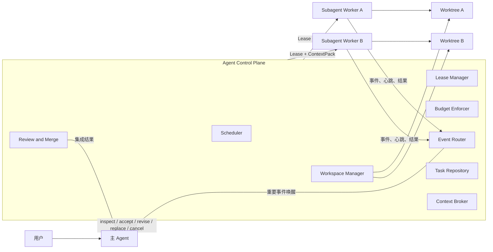
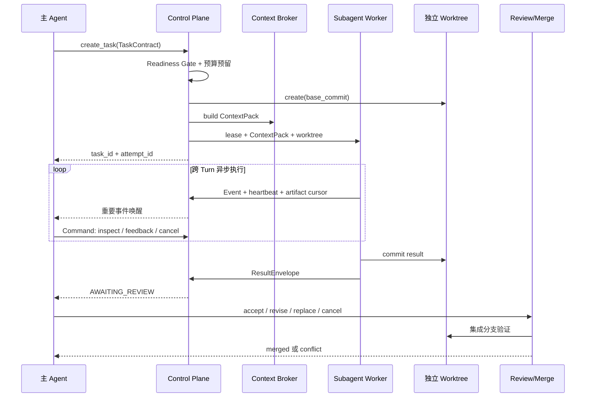
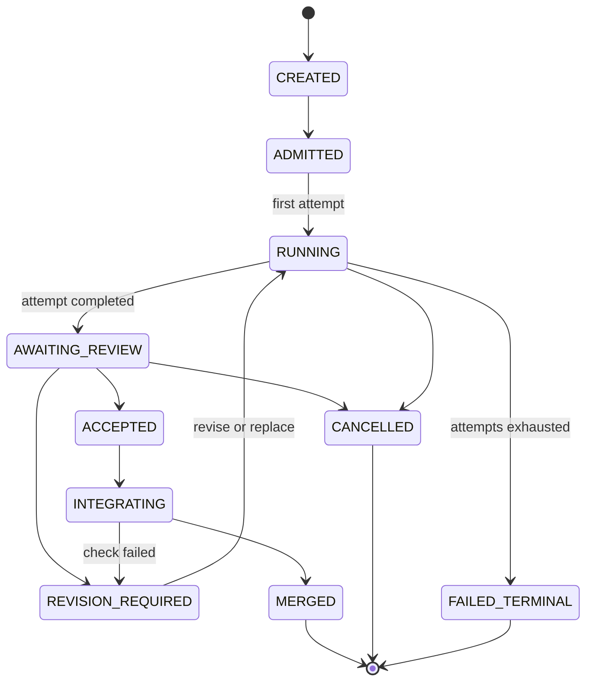
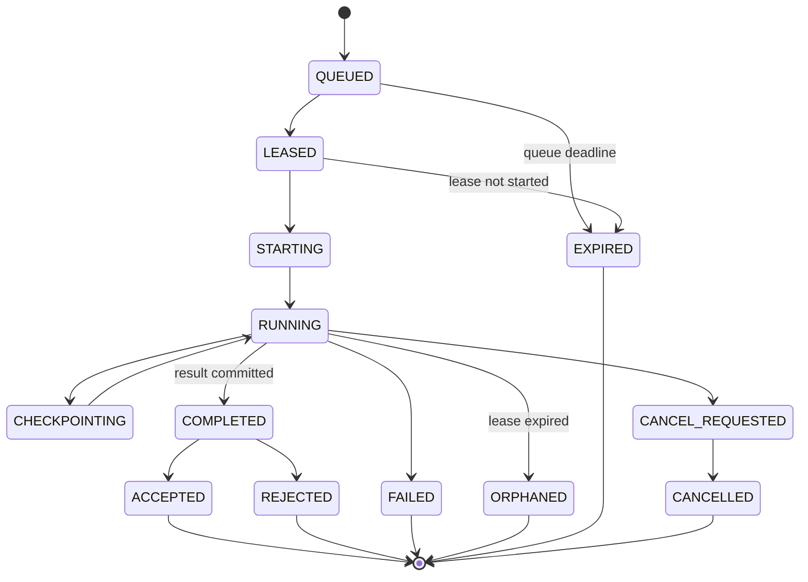

# 主子 Agent 异步协作架构

状态：设计提案

目标版本：Subagent V1

适用范围：`apps/coding-agent`

## 1. 目标

本文档定义一个允许主 Agent 自主创建一级子 Agent、异步监视执行、验收代码并合并
Git worktree 的架构。子 Agent 可以跨 Turn 运行，但不得递归创建孙 Agent。

系统需要满足以下目标：

- 主 Agent 与子 Agent 的模型调用和工具执行互不阻塞。
- 每个子 Agent 使用独立 Git worktree，不能直接修改主工作区。
- 主 Agent 可以随时检查增量进度、取消任务、要求返工或创建替代执行。
- 子 Agent 的完成不等于任务完成；只有通过验收并成功集成才算完成。
- Deadline、预算、租约、并发和重试上限由 Runtime 强制执行，不能依赖提示词。
- 进程重启后可以识别并恢复、接管或终止未完成任务。
- 所有任务、尝试、事件、验收和合并行为均可追踪。

## 2. 非目标

Subagent V1 不包含：

- 子 Agent 递归创建其他 Agent。
- 多主 Agent 共同拥有同一个子任务。
- 子 Agent 直接合并主分支或向远程仓库 push。
- 对数据库、云资源等外部副作用提供通用事务回滚。
- 跨机器迁移正在运行的模型调用或本地进程。
- 自动解决任意 Git 语义冲突。

## 3. 核心原则

### 3.1 控制面与运行面分离

主 Agent 是控制面，负责分解、调度意图、检查结果和验收决策。子 Agent 是运行面，
只负责完成一份边界明确的任务契约。

Scheduler、Lease Manager、Budget Enforcer 和 Workspace Manager 属于可信 Runtime。
它们执行硬约束，不能由主 Agent 或子 Agent 绕过。

### 3.2 任务与尝试分离

`AgentTask` 表示稳定的逻辑目标，`AgentAttempt` 表示一次不可变的执行尝试。返工、
替换和崩溃恢复都创建新 Attempt，不覆盖旧 Attempt。

```text
AgentTask
  ├── Attempt 1: rejected
  ├── Attempt 2: orphaned
  └── Attempt 3: accepted -> merged
```

### 3.3 Git 是代码交付协议

子 Agent 通过 commit 交付代码，而不是把工作区文件直接复制回主工作区。验收基于：

- 固定的 `base_commit`
- 子 Agent 的 `result_commit`
- 可复现的 diff
- 结构化测试证据
- 集成分支上的最终验证

### 3.4 至少一次事件，幂等消费

任务事件采用持久化、至少一次投递。消费者通过 `event_id`、`attempt_id` 和
`idempotency_key` 去重。不要依赖内存回调实现跨 Turn 可靠通信。

### 3.5 上下文隔离与按需引用

主 Agent 不共享子 Agent 的完整对话历史。上下文分为三层：

- `TaskContract`：主 Agent 定义的稳定目标、范围、约束和验收标准。
- `AttemptContext`：子 Agent 私有的模型消息、工具结果和 checkpoint。
- `ObservationContext`：主 Agent 可见的进度摘要、阻塞、结果和证据引用。

`Context Broker` 负责构建、裁剪、版本化和恢复上下文。大块源码、日志和工具输出只保存
在 Artifact Store，通过引用按需读取，不能反复注入主 Agent 上下文。

## 4. 总体架构



## 5. 领域模型

### 5.1 标识

下列标识必须贯穿数据库、事件、日志和 Trace：

| 标识 | 含义 |
|---|---|
| `parent_session_id` | 主 Agent 会话 |
| `parent_turn_id` | 创建任务或最近决策所在 Turn |
| `logical_task_trace_id` | 聚合跨 Turn、跨进程 Trace 的逻辑标识 |
| `task_id` | 逻辑子任务 |
| `attempt_id` | 一次执行尝试 |
| `agent_run_id` | 子 Agent 的 LangGraph 运行 |
| `worktree_id` | 独立工作树 |
| `lease_id` | 当前租约 |
| `lease_epoch` | 防止旧 Worker 写入的 fencing token |
| `base_commit` | 子任务开始时的代码基线 |
| `result_commit` | 子 Agent 提交的结果 |
| `event_id` | 可去重事件 |

### 5.2 AgentTask

```text
task_id
parent_session_id
created_by_turn_id
logical_task_trace_id
objective
status
priority
base_commit
task_contract_json
budget_limit_json
budget_used_json
deadline_at
max_attempts
active_attempt_id
accepted_attempt_id
created_at
updated_at
```

`AgentTask.status` 建议使用：

```text
CREATED
ADMITTED
RUNNING
AWAITING_REVIEW
REVISION_REQUIRED
ACCEPTED
INTEGRATING
MERGED
CANCELLED
FAILED_TERMINAL
```

### 5.3 AgentAttempt

```text
attempt_id
task_id
attempt_number
supersedes_attempt_id
status
agent_run_id
worker_id
worktree_id
branch_name
base_commit
result_commit
review_feedback_json
checkpoint_ref
context_pack_ref
soft_deadline_at
hard_deadline_at
started_at
ended_at
failure_code
```

`AgentAttempt.status` 建议使用：

```text
QUEUED
LEASED
STARTING
RUNNING
CHECKPOINTING
CANCEL_REQUESTED
CANCELLED
COMPLETED
FAILED
ORPHANED
EXPIRED
REJECTED
ACCEPTED
```

### 5.4 AgentLease

```text
lease_id
attempt_id
worker_id
lease_epoch
issued_at
expires_at
heartbeat_at
revoked_at
```

所有 Attempt 状态更新、事件写入和结果提交都必须携带 `lease_epoch`。数据库只接受当前
epoch，避免已失效 Worker 恢复后覆盖新 Worker 的状态。

### 5.5 AgentEvent

```text
event_id
task_id
attempt_id
sequence
correlation_id
causation_id
lease_epoch
event_type
severity
payload_json
artifact_ref
created_at
```

高频输出应写入 Artifact Store，事件只保存游标、摘要和引用。

事件不能使用单个 `consumed_at` 表示消费状态，因为 Scheduler、主 Agent、Web UI 和
Trace Exporter 会独立消费。每个消费者使用单独的 offset：

```text
consumer_id
stream_id
last_sequence
updated_at
```

### 5.6 AgentCommand

主 Agent 到子 Agent 的控制消息与子 Agent 上报的 Event 分离：

```text
command_id
task_id
attempt_id
command_type
payload_json
expected_state_version
idempotency_key
created_by_turn_id
created_at
acknowledged_at
```

Command 必须被显式 ACK，并通过 `expected_state_version` 执行 CAS 状态迁移。

### 5.7 ContextPack

```json
{
  "context_version": 3,
  "task_id": "...",
  "attempt_id": "...",
  "base_commit": "abc123",
  "objective": "修复 ToolRun 取消状态竞争",
  "constraints": [],
  "acceptance": [],
  "file_refs": [],
  "artifact_refs": [],
  "previous_attempt_summary": null,
  "parent_decision_seq": 7
}
```

Context Pack 必须有大小预算和内容哈希。子 Agent 定期生成 `ProgressDigest`，其中只包含：

```text
current_plan
completed_items
active_blocker
changed_files
latest_evidence_refs
next_action
```

### 5.8 TaskContract

主 Agent 创建子任务时必须生成结构化契约：

```json
{
  "objective": "修复 ToolRun 取消状态竞争",
  "scope": ["coding_agent/execution/**", "tests/test_tool_runs.py"],
  "base_commit": "abc123",
  "acceptance": [
    "取消后进程组被终止",
    "终态事件只发送一次",
    "现有 ToolRun 测试通过"
  ],
  "dependencies": [],
  "expected_artifacts": ["result commit", "test evidence"],
  "risk_level": "medium",
  "required_checks": [
    "uv run pytest -q tests/test_tool_runs.py"
  ],
  "forbidden_actions": [
    "修改主工作区",
    "访问生产环境",
    "创建孙 Agent"
  ],
  "context_refs": [],
  "deadline_at": "2026-09-14T12:00:00Z",
  "budget": {},
  "idempotency_key": "task:cancel-race:v1"
}
```

### 5.9 ResultEnvelope

```json
{
  "status": "completed",
  "summary": "修复取消与完成竞争",
  "base_commit": "abc123",
  "commit_sha": "def456",
  "changed_files": ["coding_agent/execution/tool_runs.py"],
  "checks": [
    {
      "command": "uv run pytest -q tests/test_tool_runs.py",
      "exit_code": 0,
      "artifact_ref": "sha256:..."
    }
  ],
  "risks": [],
  "unresolved": [],
  "budget_usage": {}
}
```

## 6. 主流程



## 7. 调度与非阻塞通信

### 7.1 提交

主 Agent 调用 `create_agent_task` 后只等待任务持久化和 Attempt 建立，不等待子 Agent
完成。返回值至少包含：

```json
{
  "task_id": "...",
  "attempt_id": "...",
  "status": "QUEUED",
  "next_event_cursor": 0
}
```

### 7.2 事件邮箱

每个主会话拥有持久化事件邮箱。主 Agent 可以通过
`inspect_agent_task(task_id, after_cursor)` 增量读取。

通信分为三个通道：

| 通道 | 方向 | 内容 |
|---|---|---|
| Command | 主 Agent -> Control Plane -> 子 Agent | START、FEEDBACK、CHECKPOINT、CANCEL |
| Event | 子 Agent -> Control Plane -> 主 Agent | HEARTBEAT、PROGRESS、NEEDS_INPUT、RESULT_READY、FAILED |
| Artifact | 双方按引用读取 | 完整日志、diff、测试输出、checkpoint 和模型摘要 |

Command 和 Event 共享关联字段；`expected_state_version` 和 `idempotency_key` 是 Command
的附加控制字段：

```json
{
  "message_id": "...",
  "task_id": "...",
  "attempt_id": "...",
  "correlation_id": "...",
  "causation_id": "...",
  "sequence": 42,
  "lease_epoch": 3,
  "expected_state_version": 8,
  "idempotency_key": "..."
}
```

其中 `message_id` 在具体存储中分别映射为 `command_id` 或 `event_id`。

Command 与状态更新应在同一数据库事务中通过 transactional outbox 写入。Event 采用至少
一次投递，每个消费者维护独立 cursor 并按 `message_id + sequence` 去重。

Scheduler 仅在以下情况唤醒主 Agent：

- Attempt 完成、失败、取消或孤儿化。
- 子 Agent 请求澄清或报告阻塞。
- 连续多个探测周期没有有效进展。
- 到达 Soft Deadline 或预算预警阈值。
- 检测到工作范围冲突或基线过旧。
- 验收测试失败或集成冲突。
- 租约即将过期且无法正常续租。

普通 stdout、stderr 和 token 流只更新 Artifact 与 cursor，不触发每块输出一次模型调用。
同一短时间窗口内的多个事件应合并为一条 wake digest，避免唤醒风暴。

### 7.3 上下文管理

主 Agent 只消费 `ProgressDigest`、`ResultEnvelope` 和显式请求的 Artifact，不读取子 Agent
完整消息历史。Context Broker 负责：

- 根据 TaskContract 和 scope 生成最小 ContextPack。
- 为 ContextPack 维护 `context_version`、内容哈希和 token 预算。
- 在目标分支变化时比较 `base_commit`，产生 context delta 或标记基线过期。
- 在跨 Turn 恢复时从 checkpoint 重建 AttemptContext。
- 对输入内容执行路径过滤、凭证脱敏和不可信指令隔离。

`REVISE` 可以继承前一 Attempt 的结果摘要和代码 commit，但不能原样继承无限增长的模型
消息。`REPLACE` 不继承旧对话，只接收原始 TaskContract、失败证据和必要 Artifact。

### 7.4 主 Agent 控制工具

建议提供以下工具：

```text
create_agent_task(contract)
list_agent_tasks(status?)
inspect_agent_task(task_id, after_cursor)
send_agent_feedback(task_id, feedback)
request_agent_revision(task_id, feedback, budget_delta?)
replace_agent_attempt(task_id, reason)
cancel_agent_task(task_id, reason)
accept_agent_result(task_id, attempt_id)
integrate_agent_result(task_id, attempt_id)
request_agent_checkpoint(task_id, reason)
```

这些工具只表达控制意图，实际状态迁移由 Control Plane 校验。

## 8. Deadline

每个 Attempt 使用三层 Deadline：

| 类型 | 行为 |
|---|---|
| `queue_deadline` | 到期仍未获得 Worker，则过期或重新排队 |
| `soft_deadline` | 禁止开始新的探索，要求保存 checkpoint 并总结 |
| `hard_deadline` | 发送取消信号，宽限期后强制终止进程组 |

Task 还必须有总 Deadline，防止通过持续创建 Attempt 绕过限制。

推荐初始默认值：

```text
queue_timeout             = 5 minutes
attempt_soft_timeout      = 15 minutes
attempt_hard_timeout      = 20 minutes
termination_grace         = 10 seconds
task_total_timeout        = 60 minutes
no_progress_timeout       = 5 minutes
```

时间判断以持久化 UTC 时间为恢复依据，单进程等待使用 monotonic clock，避免系统时间跳变。

## 9. 资源预算

预算采用父子层级：

```text
Session Budget
  -> Parent Task Budget
      -> AgentTask Budget
          -> AgentAttempt Reservation
```

预算至少覆盖：

| 类别 | 指标 |
|---|---|
| 模型 | input/output token、模型调用次数、估算费用 |
| 工具 | tool call、command、MCP call 数量 |
| 时间 | wall time、CPU time |
| 并发 | 子 Agent 数、子进程数 |
| 存储 | worktree、artifact、输出字节 |
| 代码 | 修改文件数、diff 行数 |
| 重试 | attempt、revision、replacement 次数 |
| 外部系统 | 外部调用和副作用次数 |

预算分配采用“预留、消费、释放”三阶段。多个 Agent 并行提交预算申请时，Repository 必须
在事务中原子扣减可用额度。

推荐阈值：

- 使用率达到 80%：发送 `budget.warning`，主 Agent 可以收敛或追加预算。
- 使用率达到 100%：Runtime 拒绝新动作并触发 checkpoint。
- 超过硬预算或无法 checkpoint：取消 Attempt。

预算追加必须记录批准者、原因和增量，不允许重置已消耗计数。

## 10. 租约与故障接管

Worker 获取 Attempt 后获得带 epoch 的限时租约：

```text
lease_ttl          = 30 seconds
heartbeat_interval = 10 seconds
```

续租要求：

- Worker 身份、`lease_id` 和 `lease_epoch` 匹配。
- Attempt 未被取消、替换或达到 Hard Deadline。
- 当前资源使用没有超过硬预算。

租约过期后的处理：

1. 将 Attempt 标记为 `ORPHANED`。
2. 拒绝旧 epoch 的后续事件、状态更新和结果提交。
3. 终止仍可定位的进程组。
4. 检查 Git 状态、最近 checkpoint 和输出 Artifact。
5. 可恢复时创建新 Attempt 并引用旧 checkpoint。
6. 不可恢复时从固定 `base_commit` 创建干净 worktree。
7. 超过 Task 的重试或预算上限后进入 `FAILED_TERMINAL`。

进程恢复不是原地复活旧 Attempt，而是创建拥有新 lease epoch 的新 Attempt。

## 11. Worktree 隔离与集成

### 11.1 创建

每个 Attempt 使用独立分支和目录：

```text
branch:   agent/<task_id>/<attempt_number>
worktree: <agent-data>/worktrees/<attempt_id>
```

Workspace Manager 必须记录 worktree、分支、base commit 和所有权。子 Agent 只能访问自己的
worktree，不能访问主工作区或其他 Agent 的 worktree。

新 Attempt 的派生规则必须固定：

- `REVISE`：创建新 worktree，以被拒绝 Attempt 的 `result_commit` 为基线。
- `REPLACE`：创建新 worktree，以 AgentTask 的原始 `base_commit` 为基线。
- `RECOVER`：创建新 worktree，优先使用已验证 checkpoint 对应的 commit，否则回到原始
  `base_commit`。

旧 Attempt 的 worktree 和上下文保持只读，直到审计保留期结束。不得在同一 worktree
中用新的 Attempt 覆盖旧执行历史。

### 11.2 冲突预防

物理隔离不能解决逻辑冲突。Scheduler 应根据 TaskContract 的 `scope` 建立意图锁：

- 只读任务可以并行。
- 写入范围不相交可以并行。
- 写入范围重叠时默认串行。
- 范围未知的写任务按仓库级冲突处理。

意图锁用于准入优化，不替代最终 Git 冲突检测。

### 11.3 集成

验收通过后：

1. 创建短期集成分支和 `merge_lease`。
2. 检查主分支是否仍是兼容基线。
3. 将 `result_commit` rebase 或 cherry-pick 到集成分支。
4. 执行 TaskContract 的 required checks 和受影响测试。
5. 检查 diff 范围、敏感文件、生成文件和外部副作用。
6. 验证通过后快进或提交到目标分支。
7. 记录最终 commit，并将 Task 标记为 `MERGED`。

子 worktree 中测试通过不代表集成通过。合并后必须重新验证。

## 12. 验收闭环

### 12.1 Task Readiness Gate

任务进入队列前必须满足：

- 目标单一且可以验证。
- 允许修改的 scope 明确。
- 输入依赖和 `base_commit` 已固定。
- 每条验收标准都能映射到检查或证据。
- 交付物、禁止行为、Deadline 和预算明确。
- 与其他任务的依赖和写入冲突已解析。

复杂目标应先生成 Task DAG。只有依赖满足且 scope 不冲突的节点可以并行。Readiness
Gate 不通过时，Control Plane 应拒绝调度并返回缺失字段，不允许子 Agent 自行猜测任务。

Scheduler 应根据任务类型、风险、上下文长度和工具需求选择子 Agent profile，不能把所有
任务无差别发送给同一种 Agent。至少区分 implementation、investigation、test 和 review。

### 12.2 确定性验收

由 Runtime 执行：

- `base_commit` 和 `result_commit` 存在且可达。
- commit 只修改允许范围。
- required checks 有可验证的 exit code 和 Artifact。
- 没有未提交文件、未跟踪敏感文件或越权路径。
- 预算、Deadline 和租约均合法。
- 集成分支能够应用结果 commit。

### 12.3 语义验收

由主 Agent 根据目标、diff、测试证据和风险判断：

| 决策 | 条件 | 后续 |
|---|---|---|
| `ACCEPT` | 目标和证据均满足 | 进入集成 |
| `REVISE` | 方向正确且问题局部可修复 | 从旧 result commit 创建新 Attempt/worktree |
| `REPLACE` | 方向错误、上下文污染或长期无进展 | 从原始 base commit 创建干净 Attempt/worktree |
| `CANCEL` | 任务重复、过期或不再有价值 | 终止并封存证据 |

子 Agent 的自述不能作为验收结论，只能作为待验证证据。高风险变更应由主 Agent 创建一个
独立的一级 Review Agent；Reviewer 只接收 TaskContract、diff 和证据，不接收执行者的
完整推理过程。Review Agent 使用只读工具策略，不拥有结果分支的修改或合并权限。

验收结果必须形成证据矩阵：

```text
acceptance criterion -> evidence -> result -> confidence -> blocking finding
```

`REVISE` 的反馈必须结构化：

```json
{
  "findings": [
    {
      "severity": "blocking",
      "location": "coding_agent/execution/tool_runs.py",
      "problem": "取消与完成可能重复发送终态事件",
      "expected": "每个 Attempt 只产生一个终态事件",
      "evidence": "test_cancel_completion_race"
    }
  ],
  "required_checks": [],
  "budget_delta": {}
}
```

## 13. 生命周期状态机

Task 与 Attempt 必须使用两套状态机。Task 表示逻辑目标，Attempt 表示一次物理执行，
不得把重试控制状态写入 Attempt，也不得把 Worker 运行状态写入 Task。

### 13.1 AgentTask 状态机



### 13.2 AgentAttempt 状态机



`ORPHANED`、`FAILED` 或 `REJECTED` 的 Attempt 本身不会恢复到 `RUNNING`。如果 Task
仍可继续，Scheduler 创建新的 `QUEUED` Attempt，并通过 `supersedes_attempt_id` 建立关系。

所有状态迁移必须使用数据库 compare-and-swap，例如：

```sql
UPDATE agent_attempts
SET status = :next_status
WHERE attempt_id = :attempt_id
  AND status = :expected_status
  AND lease_epoch = :lease_epoch;
```

受影响行数不是 1 时，调用方必须按状态竞争处理，不能静默覆盖。

## 14. 重试与故障分类

| 故障 | 默认动作 |
|---|---|
| 模型瞬时错误 | 当前 Attempt 内有限退避重试 |
| Worker 崩溃 | 租约过期，创建恢复 Attempt |
| 无进展超时 | 唤醒主 Agent，决定 revise/replace/cancel |
| 工具确定性失败 | 不原样重试，要求改变输入或方案 |
| 测试失败 | 进入 Review，由主 Agent给出结构化反馈 |
| Git 冲突 | 集成失败，不直接修改主分支 |
| 预算耗尽 | checkpoint 后暂停或取消 |
| Hard Deadline | 强制取消进程组 |
| 事件重复 | 使用 `event_id` 和 sequence 去重 |
| 旧 Worker 回写 | 使用 `lease_epoch` 拒绝 |
| Host 重启 | 扫描非终态任务并执行租约恢复 |

建议默认限制：

```text
max_active_subagents_per_session = 4
max_attempts_per_task            = 3
max_revisions_per_task           = 2
max_replacements_per_task        = 1
max_model_retries_per_attempt    = 2
```

## 15. 取消语义

取消分为协作取消和强制取消：

1. Control Plane 将 Attempt 原子迁移到 `CANCEL_REQUESTED`。
2. Worker 收到取消事件，停止创建新工具调用。
3. Worker 保存可用 checkpoint，并终止其子进程组。
4. 在 `termination_grace` 内上报最终状态。
5. 超时后 Runtime 强制杀死进程组并标记 `CANCELLED`。
6. 撤销租约、释放未消费预算和意图锁。

取消必须向下传播到子 Agent 创建的 ToolRun，但不会传播到其他独立 AgentTask。

## 16. 持久化与恢复
数据库是状态事实来源，内存对象只是缓存。至少需要以下表：

```text
agent_tasks
agent_attempts
agent_leases
agent_budgets
agent_events
agent_commands
agent_reviews
agent_consumer_offsets
agent_context_packs
agent_integrations
agent_artifacts
```

Host 启动恢复流程：

1. 查找所有非终态 Task 和 Attempt。
2. 将已过期租约对应 Attempt 标记为 `ORPHANED`。
3. 校验 worktree、分支和 commit 是否存在。
4. 恢复每个消费者各自的事件 cursor。
5. 对可恢复任务创建新 Attempt。
6. 对不可恢复任务生成失败事件，等待主 Agent处理。
7. 清理超过保留期限且无活跃引用的 worktree。

建议失败 worktree 保留 24 小时，成功合并 worktree 保留 1 小时，之后由 Reaper 删除。

主会话长期离线时默认允许已运行 Attempt 继续执行，但不能无限等待主 Agent：

- `NEEDS_INPUT` 超过响应期限后 checkpoint 并取消当前 Attempt；恢复时创建新 Attempt。
- 已完成结果保留到 Task Deadline，等待主 Agent验收。
- Task Deadline 到期仍未验收时自动取消，禁止自动合并。

## 17. Trace 与可观测性

### 17.1 逻辑任务与物理 Trace 分离

`AgentTask` 可以跨越多个 Turn 和进程生命周期，因此不能作为 `parent.turn` 下长期不结束
的嵌套 Span。每个物理执行单元建立独立 Trace，再使用 `logical_task_trace_id` 聚合：

```text
logical_task_trace_id
├── parent turn trace
├── attempt-1 trace
├── attempt-2 trace
├── review trace
└── integration trace
```

Attempt 内部使用正常父子 Span：

```text
agent.attempt
├── context.build
├── model.call
├── tool.run
├── checkpoint.write
├── lease.renew
└── result.commit
```

### 17.2 跨 Trace 因果关系

跨 Turn 和跨进程关系使用 Span Link：

```text
parent.dispatch  --spawned-->     attempt.start
agent.event      --triggered-->   scheduler.wake
parent.inspect   --observed-->    attempt.progress
review           --evaluated-->   attempt.result
attempt-2        --supersedes-->  attempt-1
integration      --based_on-->    accepted result
```

每个相关 Span 至少记录：

```text
task_id
attempt_id
agent_run_id
lease_epoch
parent_session_id
parent_turn_id
base_commit
result_commit
event_sequence
```

完整日志和 diff 存入 Artifact Store，Span 只保存脱敏摘要、哈希和引用。Trace Exporter
必须能按 `logical_task_trace_id` 重建任务时间线，同时保留每个物理 Trace 的独立边界。

### 17.3 指标

关键指标：

- `active_subagents`
- `queue_latency_ms`
- `attempt_duration_ms`
- `time_to_first_progress_ms`
- `heartbeat_lag_ms`
- `budget_utilization`
- `revision_count`
- `replacement_count`
- `orphan_recovery_count`
- `acceptance_rate`
- `merge_conflict_rate`
- `task_end_to_end_ms`

## 18. 安全边界

- 子 Agent继承主 Agent的工具策略，但可以进一步收窄，不得扩大。
- 子 Agent不能创建 Agent，也不能调用管理其他 Task 的控制工具。
- Worktree 路径由服务端映射，模型只接触逻辑 ID。
- 所有命令继续经过 `CommandPolicy`，并绑定 Attempt 的进程组。
- 外部副作用必须显式声明、单独计数，默认禁止并行重复执行。
- Artifact、事件和模型上下文写入前继续执行凭证脱敏。
- 合并权限只属于 Review/Merge 服务，子 Agent没有目标分支写权限。

## 19. 与现有 ToolRun 的关系

现有 `ToolRunManager` 继续负责一个 Agent 内部的后台命令和 MCP 调用。新的
`AgentTaskManager` 负责跨 Turn 子 Agent：

| 能力 | ToolRun | AgentTask/Attempt |
|---|---|---|
| 生命周期 | 当前 Turn | 可跨 Turn |
| 执行单元 | 工具调用 | 完整 Agent |
| 工作区 | 当前 Agent 工作区 | 独立 worktree |
| 持久化 | 进程内状态为主 | 数据库事实来源 |
| 调度 | 线程池 | Scheduler + Worker + Lease |
| 预算 | 并发和输出上限 | 分层资源预算 |
| 恢复 | Turn 结束前收敛 | 新 Attempt 接管 |
| 结果 | 工具返回值 | commit + evidence |

不要直接让 `ToolRunManager` 跨 Turn 存活。应新增独立模块，并让每个子 Agent Runtime
内部继续使用自己的 `ToolRunManager`。

## 20. 推荐模块边界

```text
coding_agent/subagents/
├── models.py          # Task、Attempt、Lease、Budget、Command、Event
├── repository.py      # 持久化和 CAS 状态迁移
├── manager.py         # 面向主 Agent 的控制 API
├── scheduler.py       # 准入、队列、唤醒、重试
├── worker.py          # 子 Agent Runtime 生命周期
├── context.py         # ContextPack、摘要、版本和裁剪
├── commands.py        # Command outbox、ACK 和取消传播
├── leases.py          # 租约、heartbeat、fencing
├── budgets.py         # 预留、消费、释放和硬限制
├── workspace.py       # branch/worktree 创建与回收
├── readiness.py       # TaskContract 完整性和调度准入
├── review.py          # 确定性验收和证据矩阵
├── integration.py     # 集成分支、复测、合并
├── events.py          # Event inbox、去重和消费者 cursor
├── tracing.py         # logical trace 聚合和 span links
└── recovery.py        # Host 重启恢复和 Reaper
```

## 21. 分阶段实现

### Phase 1：单子 Agent 闭环

- 持久化 Task、Attempt、Command、Event 和消费者 cursor。
- 创建独立 worktree。
- 支持创建、检查、取消和完成。
- 引入最小 ContextPack 和 ProgressDigest。
- 主 Agent手动 ACCEPT/REVISE/CANCEL。
- 不做崩溃接管，只在重启时标记失败。

### Phase 2：并行与验收

- 增加并发准入和 scope 意图锁。
- 增加 Task Readiness Gate、确定性验收和集成分支。
- 支持 REPLACE、结构化反馈和合并后复测。
- 支持高风险任务的独立 Review Agent。
- 接入跨 Turn 事件唤醒。

### Phase 3：租约、预算与恢复

- 增加 heartbeat、lease epoch 和 orphan recovery。
- 增加分层预算、Soft/Hard Deadline。
- 增加 checkpoint 接管和 worktree Reaper。
- 完善 Trace、指标和故障注入测试。

## 22. 验收条件

- 主 Agent可以同时启动至少两个独立子 Agent，当前 Turn 不被阻塞。
- 子 Agent跨 Turn 运行时，主 Agent仍可继续响应用户。
- 每个子 Agent只能修改自己的 worktree。
- 重复事件、重复创建请求和重复结果提交不会产生重复任务或重复合并。
- 主 Agent可以读取增量事件并执行 ACCEPT、REVISE、REPLACE、CANCEL。
- REVISE 和 REPLACE 创建新 Attempt，旧 Attempt 保持可审计。
- REVISE 从旧 result commit 派生，REPLACE 从原始 base commit 派生。
- 主 Agent和子 Agent不共享完整对话，只通过版本化 ContextPack、摘要和 Artifact 引用传递上下文。
- Command 可确认且幂等；多个消费者可以独立读取同一 Event 流。
- 不完整的 TaskContract 无法通过 Readiness Gate。
- 高风险任务可以由独立一级 Review Agent 生成证据矩阵。
- Hard Deadline、预算耗尽和租约过期能够终止或接管任务。
- 旧 lease epoch 无法写入状态或提交结果。
- 合并前后都执行要求的验证，失败时不污染目标分支。
- Host 重启后所有非终态任务都有明确的恢复、失败或取消结果。
- Trace 可以通过 logical task ID 和 Span Link 重建 dispatch、attempt、wake、review 和 integration 因果链。
